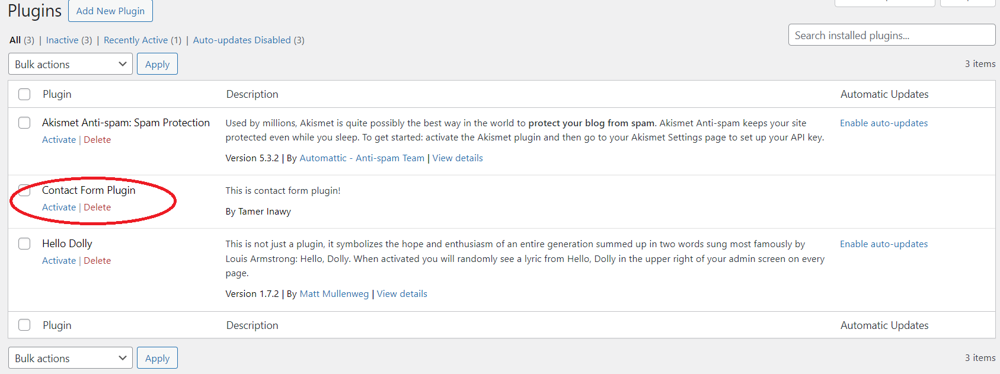

# Challenge Solution
This project provides a solution for the [challenge from Webcicient](https://doc.clickup.com/9015258856/p/h/8cnkvq8-17615/a53c839aef0d9a0).

The project consists of a simple landing page and a basic WordPress plugin that sets up a REST endpoint for a contact form submission on the WordPress site where the plugin is activated.

## Installation
Below are the instructions to install the project on your local machine using Docker.

### Prerequisites
- Docker
- Docker compose

### Steps
1. Ensure that ports 3000 and 80 are available on your local machine or edit docker-compose.yml to use different ports.

2. Navigate to the root directory of the project and execute the following command:
```
docker-compose up -d
```

3. Wait a few minutes for the containers to start then open [http://localhost/](http://localhost/) and follow the instructions to setup WordPress.

4. Create an application password on WordPress following [these instructions](https://agilitywriter.ai/guide/application-password-for-wordpress/). Don't forget to save the password somewhere.

5. Activate the Contact Form Plugin at <http://localhost/wp-admin/plugins.php> by clicking Activate under the plugin name (Contact Form Plugin).


6. Update the landing page container with the credentials (username and application password) using one of the following methods:

    a. Use update-credentials.sh by applying the following command from the project root. Replace \<username\> and \<password\> with the actual username and password from step number 4, remove the spaces from the password:
    ```
    bash web/update-credentials.sh -u <username> -p <password>
    ```

    b. Manually update the file web/.env.local with the username and password, then copy it to the container using the following command.
    ```
    docker-compose cp ./web/.env.local next:/app/landingpage/.env.local
    ```

Now the project is up and running on your local machine. You can start using the landing page at <http://localhost:3000>.

If you have any questions, please contact me at <tamer.inawy@gmail.com>.
